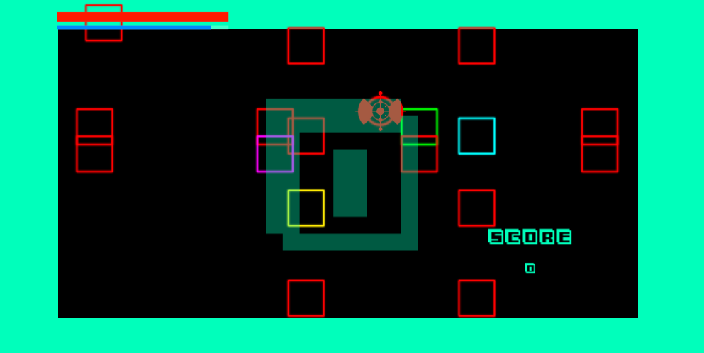
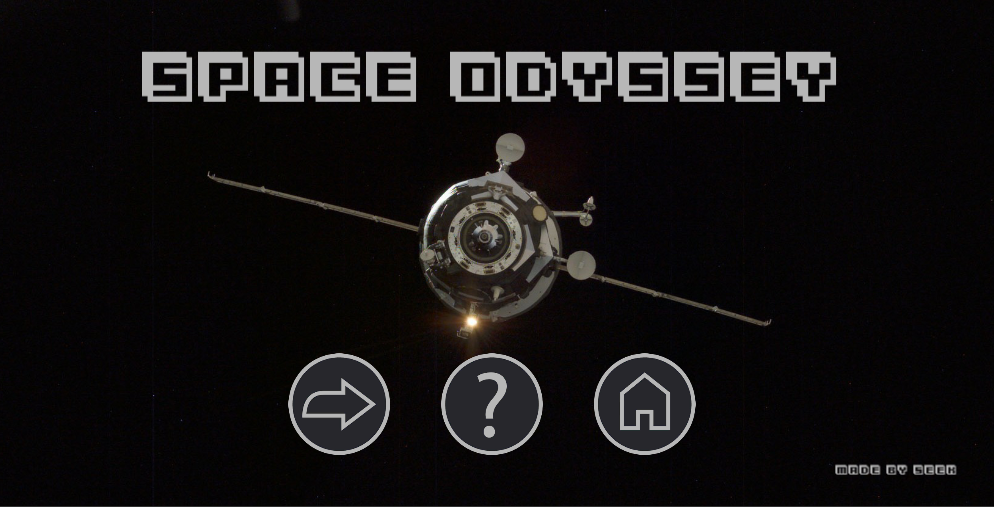
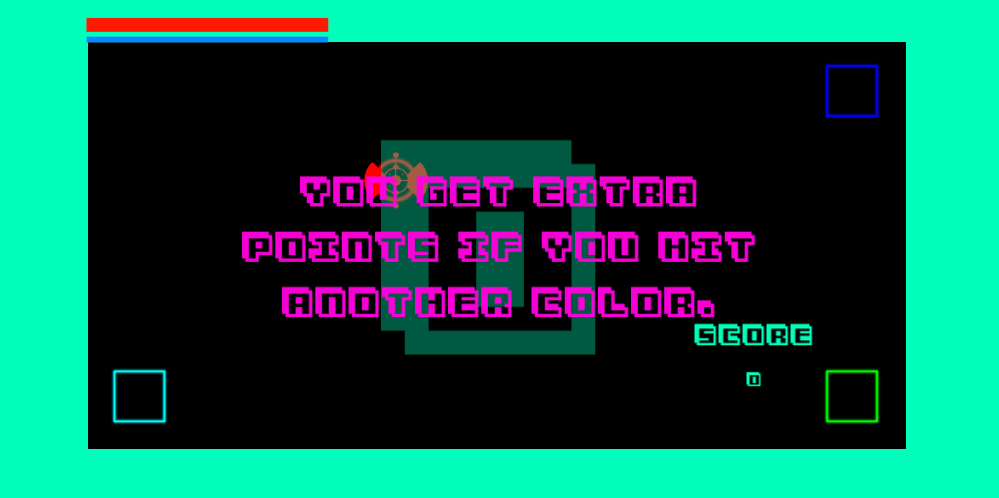
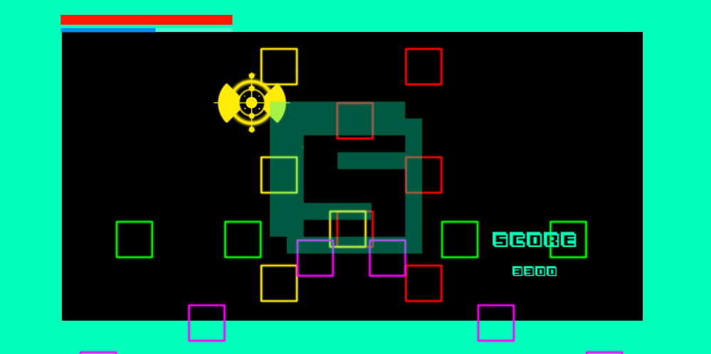
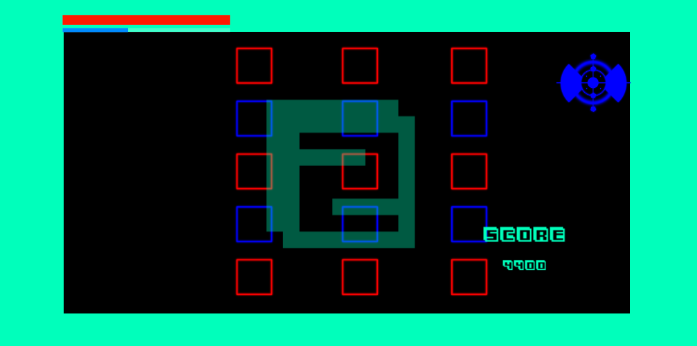
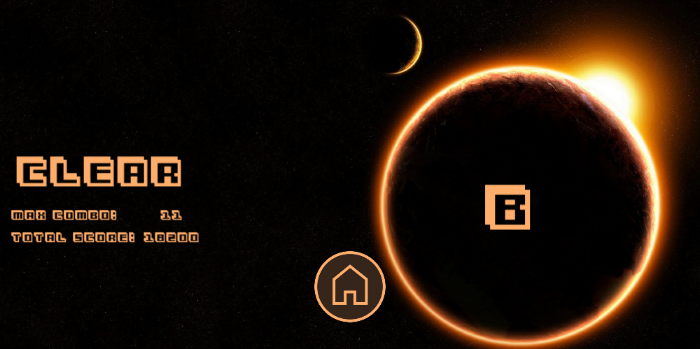

# Space Odyssey
## 게임 개요

간단한 터치를 이용한 장애물 피하기 게임입니다.
같은 색깔의 장애물을 부딪치면 페널티가 있지만 다른 색깔의 장애물을 부딪치면 추가 점수를 얻는 게임입니다.
다른 색깔의 장애물을 부딪칠 때마다 색이 변하면서 역동적이고 색채감이 있는 게임을 만들고 싶었습니다.

플랫폼 : 안드로이드
제작인원 : 1명
제작자 : 이식
제작기간 : 2주

## 사용 도구
개발툴 : unity 2.17, Visual Studio 2019

사용 언어 : c#

유니티 에셋 :
- 48 particle Effect pack
- retro sound effect
- simple health bar
- clean vector icon

기타 참고:
- ペンパイナッポーアッポーペン(PPAP)

## 소스코드 설명 및 주요 기능
- ClearManager.cs : 클리어 씬을 관리하는 코드
  - 최종 게임 점수 출력
  - 시작 화면으로 전환 (ToStartGame())
- MainCameraScript.cs : 카메라 뷰를 관리하는 코드
  - 충돌시 화면 흔들림
  - 화면 흔들림 실행 함수(CameraEffect(float 흔들림 시간))
- PlayerScript.cs : 사용자가 조종하는 플레이어를 관리하는 코드
  - 화면 클릭 위치 안내
  - 무적 모드 자동 해제
  - 플레이어 커지는 효과(GrowPlayer(bool 커지는지 줄어드는지 여부))
  - 충돌 시 효과음 재생  (CollisionSound(bool 커지는지 줄어드는지 여부))
  - 충돌 관리 함수(GetCollision(Color 장애물 색))
  - 충돌 시 플레이어 반짝임 효과 ( glitter(Color 플레이어 색,Color 장애물 색))
  - 화면 클릭 위치 안내(mouseEffect(GameObject 클릭 관련 프리펫, Color 플레이어색 ,Vector3 클릭화면 좌표))
  - 충돌 시 파티클 효과 (ParticleEffect(Color 플레이어 색,Color 장애물 색))
  - 체력 데미지 감소(TakeDamage(int 데미지량))
  - 체력 상승(HillDamage(int 회복량))
- StageDirector.cs : 스테이지를 관리하는코드(스테이지가 한개이기 떄문에 메인 게임 씬을 관리)
  - 장애물 구조체 정의
  - 스테이지 시나리오
  - 장애물 생성코드
  - 스테이지 종료후 클리어 씬 전환
- StartManager.cs :  시작화면 씬을 관리하는 코드
  - 메인게임 씬 전환(StartGame())
  - 튜토리얼 씬 전환(Tutorial())
  - 게임 종료(GameExit())
- TutorialScript.cs : 튜토리얼 씬을 관리하는 코드
  - 단계별 튜토리얼 진행 코드
  - 튜토리얼 깜박임 효과(FadeInOut())
- TutorialUnit.cs : 튜토리얼 전용 유닛(장애물)을 관리하는 코드
  - 충돌관리 함수( OnTriggerEnter2D(Collider2D 플레이어 유닛))
- Unit.cs : 메인 게임에 등장하는 유닛을 관리하는 코드
  - 장애물 이동 방향 설정
  - 장애물 패턴 이동
  - 장애물 충돌 관리 함수
  - 곡선 이동 함수(GetPointOnBezierCurve(Vector3 곡선이동 좌표, Vector3 곡선이동 좌표, Vector3 곡선이동 좌표, Vector3 곡선이동 좌표, float 시분할))

## 시연화면
- 게임 시작 화면

  

- 튜토리얼 화면

  

- 게임 플레이 화면

  

  

  

- 게임 클리어 화면

  

## 첨부자료

- 게임 플레이 녹화 영상(동영상시연.mp4)
- 안드로이드 APK 파일(space_ver4(wide).apk)
- 소스코드 (소스코드(folder))
- 게임기획 (초기기획.pdf)
